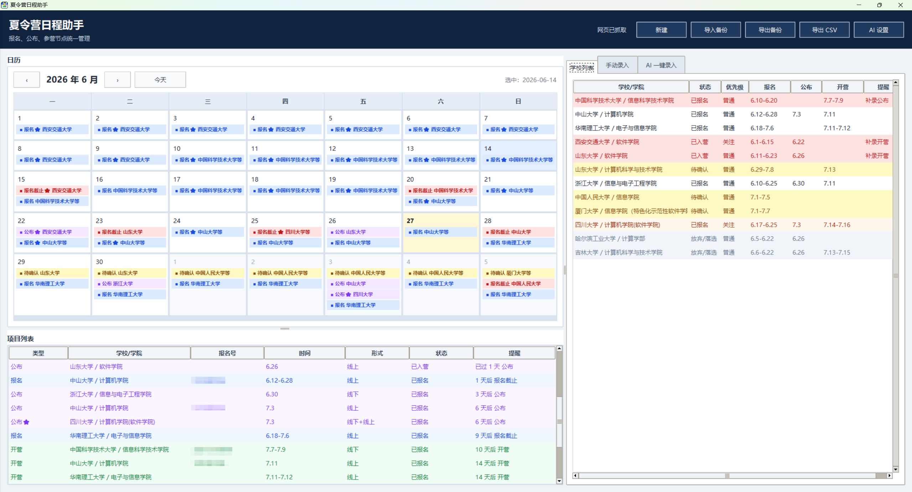
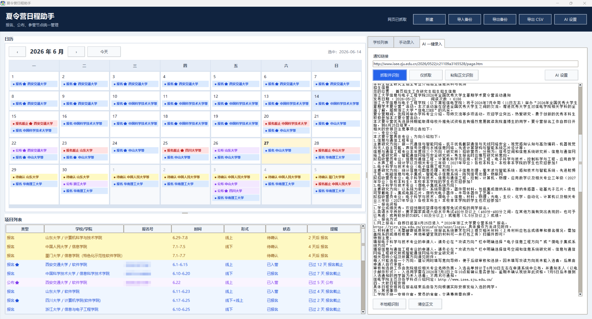
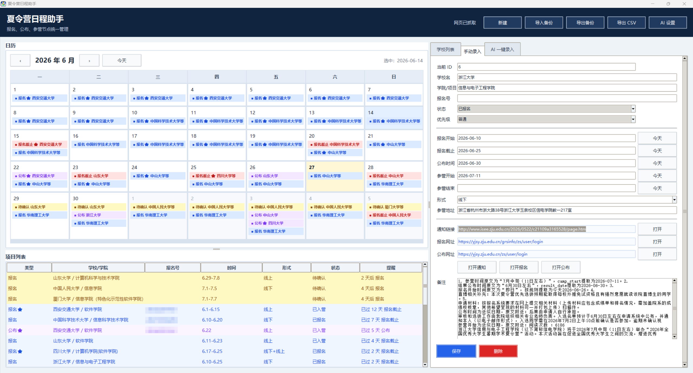

# 夏令营日程助手

夏令营日程助手是一款面向保研夏令营、预推免申请的桌面日程工具。它把分散在学校官网、公众号、报名系统里的时间节点放到一个日历里，方便你快速看清接下来要做什么。

## 适合谁用

如果你正在同时关注多个学校、多个学院，经常需要整理报名时间、公布时间、开营时间、报名链接和通知链接，这个软件会省掉很多重复整理表格的时间。

## 主要功能

- 记录学校、学院、报名号、报名时间、公布时间、开营时间、活动形式、地址、通知链接和备注。
- 日历用颜色区分待确认、报名、报名截止、公布、开营等节点。
- 支持多套界面主题，图片主题会铺满顶部和日历背景。
- 日历会随窗口高度自适应，空间不足时以等分色块保留全部事件入口。
- 项目列表会按接下来的时间排序，过期项目自动靠后，放弃/落选项目单独灰色显示。
- 支持关注学校标记，关注项目会带星标，更容易从列表里扫出来。
- 支持 AI 读取通知链接或通知正文，自动填入结构化字段。
- 支持 Excel 备份导入和导出，换电脑或重装软件时可以恢复数据。

## 下载

- Windows 安装包：[SummerCampPlannerSetup.exe](https://github.com/changganqi/Summer-Camp-Recommendation-Information-Management-APP/releases/download/v1.1.0/SummerCampPlannerSetup.exe)
- macOS 安装包：[SummerCampPlanner-macOS.dmg](https://github.com/changganqi/Summer-Camp-Recommendation-Information-Management-APP/releases/download/v1.1.0/SummerCampPlanner-macOS.dmg)

## 界面预览

主界面把日历、项目列表和后续提醒放在同一屏里，适合每天打开后快速扫一遍最近要处理的学校。

AI 一键录入可以粘贴通知链接或正文，让模型先整理出学校、学院、报名时间、公布时间、开营时间、链接和备注，再由你确认保存。

学校详情页用于查看和维护单个学校的完整信息，包括报名号、链接、形式、地点和备注。

## AI 解析

软件支持兼容 OpenAI Chat Completions 格式的接口。你可以在 `AI 设置` 里填写：

- 接口地址：例如 `https://api.deepseek.com`
- 模型名：例如 `deepseek-v4-flash`
- API Key：你的服务商密钥

设置好以后，在 `AI 一键录入` 里粘贴学校通知链接，软件会先抓取网页正文，再交给 AI 提取学校、学院、报名时间、报名网址、公布时间、开营时间、地址和备注。

## 数据安全

软件数据保存在你自己的电脑本地，不会上传到作者服务器。AI 解析时，通知正文会发送给你配置的 AI 服务商；如果不想发送某段内容，可以改用手动录入。

## Windows 安装和卸载

运行安装包后，输入安装密钥并选择安装目录，软件会自动完成安装并创建桌面快捷方式。

安装密钥可联系作者获取。软件需要联网使用网页读取与 AI 服务；如果网络不可用，软件会提示联网后重新打开。

卸载时可以在 Windows 的 `设置 > 应用 > 已安装的应用` 里找到 `夏令营日程助手`，点击卸载；也可以在安装目录里运行卸载程序。卸载会删除本机的软件数据和 AI 设置，卸载前建议先导出 Excel 备份。

## macOS 安装

macOS 版发布为 DMG 文件。下载后双击打开，将 `夏令营日程助手.app` 拖入 `Applications` 后运行。

Windows 和 macOS 使用同一种激活码。macOS 第一次打开软件时会弹出激活窗口；授权信息保存在 macOS Keychain，日程数据保存在 `~/Library/Application Support/SummerCampPlanner`。

如果 macOS 提示“无法验证开发者”，请在 Finder 中右键点击 `夏令营日程助手.app`，选择“打开”。详细说明见 [macOS 使用说明](docs/macos使用说明.md)。

## 备份建议

建议每隔几天点一次 `导出备份`，保存一份 Excel 文件。尤其是在大量修改学校信息、准备换电脑、准备重装系统前，先导出一份会安心很多。
