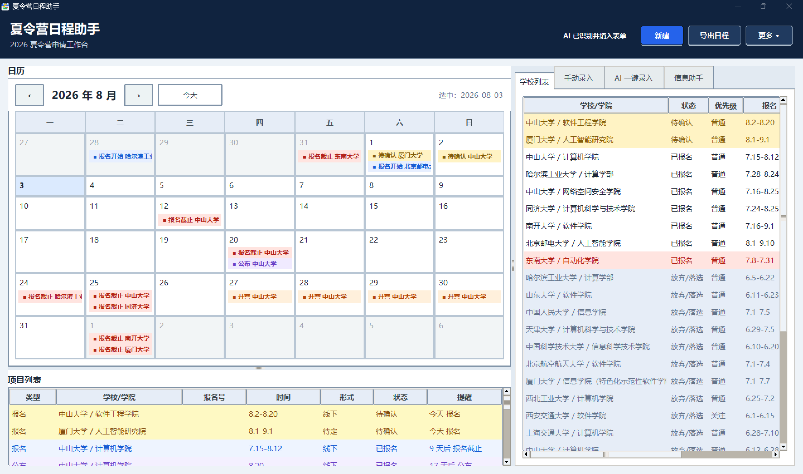
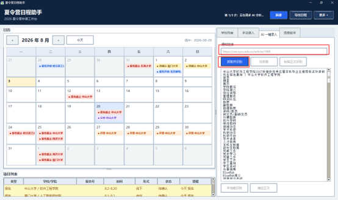
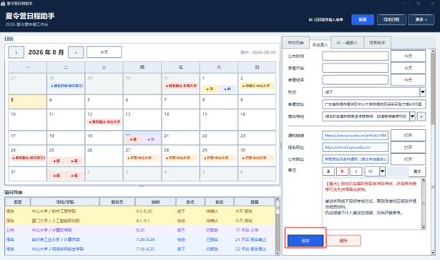
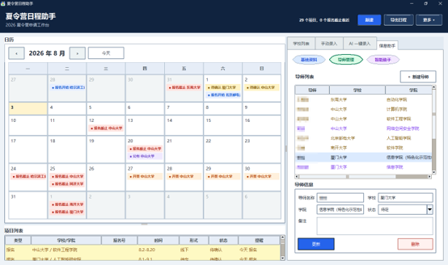
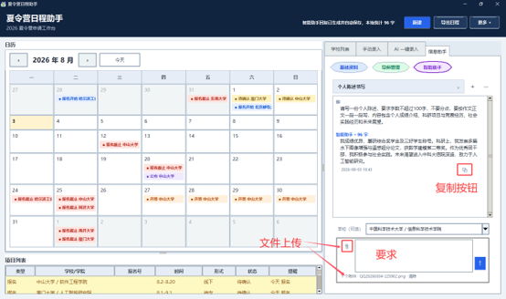

# 夏令营日程助手

夏令营日程助手是一款面向保研夏令营、预推免申请的桌面工具。它把学校、学院、报名窗口、公布时间和参营安排放进同一个日历与项目列表，方便同时跟进多个项目。

> 下方截图均来自软件真实前端；其中的学校、导师、日期和内容均为演示数据，不包含真实个人资料、报名号或 API Key。



## 日历与项目管理

- 记录学校、学院/项目、报名号、报名和公布时间、参营时间、形式、地址、导师、链接及备注。
- 日历中的报名事件只显示第一天，避免蓝色报名条铺满多日；待确认、报名开始、报名结束、公布和开营仍会正常显示。
- 日历、项目列表和学校列表可拖动调整空间。窗口变小时，日历会压缩行高，并用等分色块保留当天所有事件入口。
- 项目按下一步时间排序，关注项目带星标，放弃或落选项目灰色靠后显示。
- 表单中的常用下拉字段支持直接输入、在文字中移动光标和拖动选择；需要候选项时可点右侧箭头展开。

## AI 录入与学校信息

AI 一键录入可读取通知链接或正文，提取学校、学院、报名时间、公布时间、开营安排、链接和备注。提取结果会填入表单，仍可逐项手动修改后保存。



学校详情页用于维护单个项目的完整信息，也可以从这里关联或新建意向导师。



## 信息助手

- 基础资料用于整理个人信息和经历成果。经历成果统一采用“日期、单位/刊名、项目名、等次”四项，修改后会自动排版，支持复制和保存。
- 导师管理支持按学校检索与维护导师，状态包括成功、待定、未知、失败。未知导师从录入当天开始计时 7 天，逾期自动转为失败并清除相关学校的意向导师；失败导师不会出现在学校表单的候选项中。
- 导师可以在学校信息里顺手添加，也可以先在导师管理中建立。导师资料会随完整备份导入和导出。



## 智能助手

智能助手支持多轮对话的新建、切换、重命名和删除，可上传 PDF、Word、PNG、JPG 等本地参考文件；回复内容可以直接复制。选择学校信息后，可让助手写个人陈述、润色文字、分析简历或给出建议。固定字数的个人陈述会按正文组织，适当分段，不会被拆成一串项目符号。



`v1.5.1` 修复了智能助手输入框点击中间文字时光标回到末尾的问题，现在可以在任意位置编辑并拖动选择文字。

## 主题、备份与数据

软件内置湖畔、明亮、雾灰、纸张和夜间主题，并支持加入 JPG、PNG、WEBP 背景图。自定义主题可调整亮度、透明度、缩放方式、对齐位置和显示区域。图片会复制到软件数据目录，原图被移动或删除后仍可使用；切换主题会立即刷新。

完整备份包含日程项目、个人资料、经历成果、导师记录、智能助手会话与附件名称、个人陈述草稿、主题参数和自定义背景图片资源。日程和个人资料默认只保存在本机；AI 录入或对话时，发送给 AI 服务商的仅是你主动提交的通知正文、问题和附件内容。

## 下载与安装

- Windows：[SummerCampPlannerSetup.exe](https://github.com/changganqi/Summer-Camp-Recommendation-Information-Management-APP/releases/download/v1.5.1/SummerCampPlannerSetup.exe)
- macOS：[SummerCampPlanner-macOS.dmg](https://github.com/changganqi/Summer-Camp-Recommendation-Information-Management-APP/releases/download/v1.5.1/SummerCampPlanner-macOS.dmg)

Windows 下载后运行安装包，按提示完成安装。macOS 下载 DMG 后，将“夏令营日程助手.app”拖入 `Applications`。首次打开若提示无法验证开发者，可在 Finder 中右键点击应用并选择“打开”。更多说明见 [macOS 使用说明](docs/macos使用说明.md)。

## AI 设置

软件兼容 OpenAI Chat Completions 格式的服务。在“更多 → AI 设置”中填写接口地址、模型名和 API Key。软件不会将本机日程数据库上传到作者服务器。

## 从源码构建

Windows：

```bash
python -X utf8 build_release.py
```

macOS 由 GitHub Actions 在 `macos-14` 环境构建 DMG。构建仓库只保存源码、工作流、资源和文档，不提交本机数据库、配置文件、个人资料、密钥或构建缓存。

激活码见小黄鱼号：满天星的。
